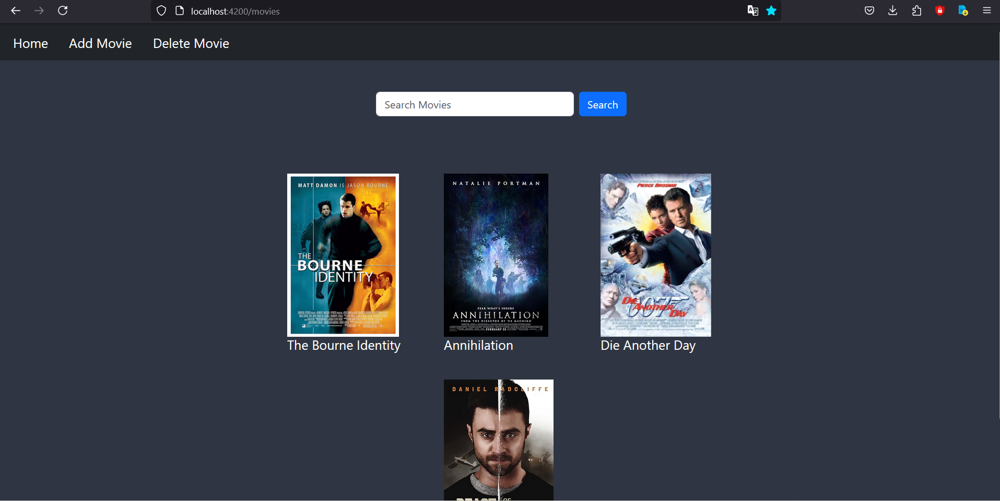

# Movie-store
* This app is used to create a movie database which is built using Angular Framework. The home screen displays a list of movies already stored in database(JSON server). Each one redirects to a page with movie details listed. There is the "Add movie" component where one add movie.
  
## Technologies used

* [Angular v15](https://angular.io/) used to build the entire front end application
* [HTML5](https://html.com/html5/) used to create the web page UI)
* [SCSS](https://sass-lang.com/)  is an acronym for Sassy Cascading Style Sheets. It is basically a more advanced and evolved variant of the CSS language.
* [RxJS Library v7](https://angular.io/guide/rx-library) used to subscribe to the API data.
* [json-server v0.17.1](https://www.npmjs.com/package/json-server) with the `db.json` file used to create a quick back-end for prototyping and mocking.

## Setup

* Firstly, install dependencies with the command `npm i`
* Then run the command `ng serve` for starting up the server
* Now, navigate to `http://localhost:4200/`. The app does automatically reload if you change any of the source files.
* Open a second command terminal and run the command `npm run api` for a local JSON server.
* Now to check the JSON server, navigate to `http://localhost:3000/`.
* The json file will be updated if a movie is added from the 'add movie' component.

## Screenshots
-------
* Home Component
.

-------
* Add movie Component
.

---------
* Movie details Component
.
